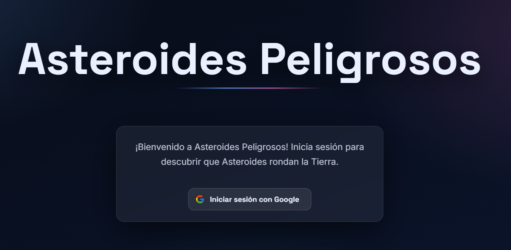
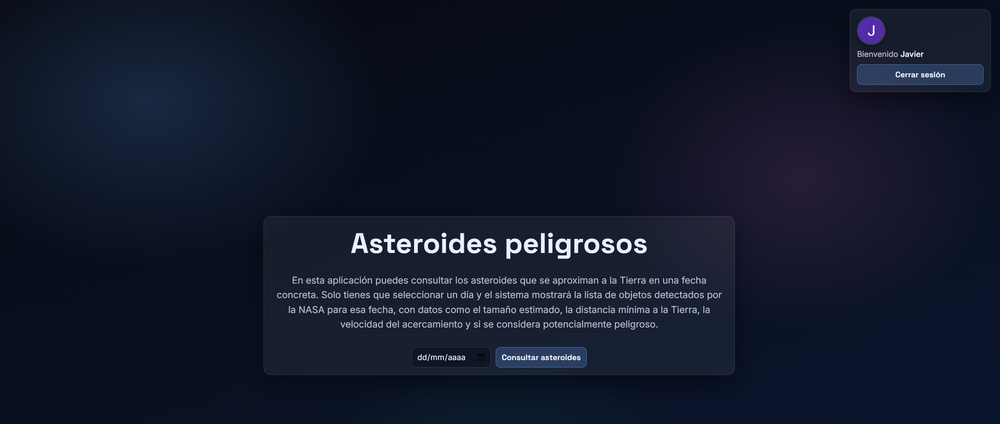
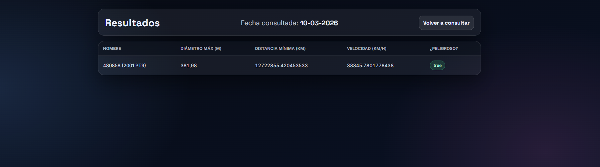
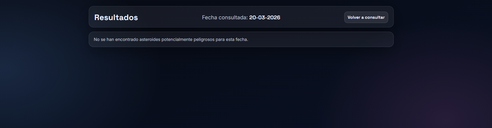
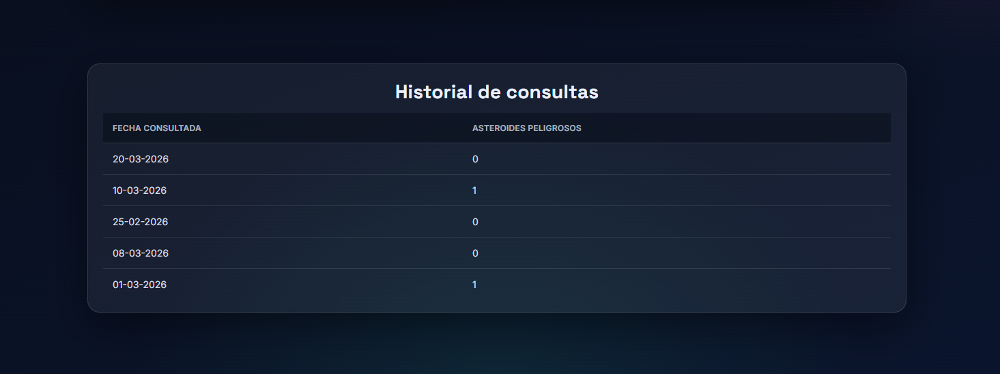

# Asteroides Peligrosos cerca de la Tierra

Aplicación web desarrollada con **Java + Spring Boot** (arquitectura MVC) que permite consultar, para un día concreto, los asteroides cercanos a la Tierra usando la API pública de la NASA ([NeoWs – Near Earth Object Web Service](https://api.nasa.gov/)) y muestra únicamente aquellos marcados como **potencialmente peligrosos**.

## Descripción

La aplicación ofrece un formulario donde el usuario selecciona una fecha. Al enviarla, el sistema consulta el endpoint `NeoWs Feed` de la NASA, parsea la respuesta JSON, filtra los asteroides que tienen el campo `is_potentially_hazardous_asteroid` a `true` y los presenta en una tabla con los siguientes datos:

- **Nombre** del asteroide.
- **Diámetro máximo estimado** (en metros).
- **Distancia mínima** de paso por la Tierra (en kilómetros).
- **Velocidad relativa** (en km/h).
- Indicación de si es **potencialmente peligroso**.

Si no se encuentran asteroides peligrosos para la fecha seleccionada, se muestra un mensaje informativo.

## Tecnologías utilizadas

- Java 21
- Spring Boot 4.0.2
- Thymeleaf
- Lombok
- Spring Security + OAuth2 (inicio de sesión con Google)
- RestClient (cliente HTTP)
- CSS personalizado

## Estructura del proyecto

```
src/main/java/com/example/asteroides/
├── AsteroidesApplication.java          # Clase principal
├── client/
│   └── NeowsClient.java               # Cliente HTTP para la API de la NASA
├── config/
│   └── SecurityConfig.java             # Configuración de seguridad OAuth2
├── controller/
│   └── AsteroideController.java        # Controlador MVC
├── dto/
│   ├── AsteroideResponse.java          # DTO de la respuesta de la API
│   └── FormularioRequest.java          # DTO del formulario de búsqueda
├── model/
│   ├── Asteroide.java                  # Modelo del asteroide (JSON)
│   ├── AsteroideVista.java             # Modelo para la vista
│   ├── ConsultaHistorial.java          # Modelo para el historial
│   └── DatosAsteroide.java             # Datos de acercamiento
└── service/
    └── AsteroideService.java           # Lógica de negocio y filtrado

src/main/resources/
├── application.properties
├── static/css/
│   ├── index.css
│   ├── login.css
│   └── resultados.css
└── templates/
    ├── index.html                      # Formulario de búsqueda
    ├── login.html                      # Página de inicio de sesión
    └── resultados.html                 # Tabla de resultados
```

## Funcionalidades implementadas

### Obligatorias
- Página de inicio con formulario de fecha y texto introductorio.
- Consulta a la API NeoWs de la NASA con la fecha seleccionada.
- Filtrado en backend de asteroides potencialmente peligrosos.
- Página de resultados con tabla de datos y enlace para volver.
- Validación de fecha (no admite fechas vacías).
- Tratamiento de errores (API no disponible, sin datos, etc.).

### Opcionales
- **Autenticación con Google** mediante OAuth2.
- **Historial de consultas** almacenado en sesión, visible en la página de inicio.
- **Diseño visual personalizado** con CSS propio (tema oscuro espacial).

## Configuración

La aplicación requiere las siguientes variables de entorno:

| Variable              | Descripción                          |
|-----------------------|--------------------------------------|
| `API_KEY`             | API Key de la NASA (https://api.nasa.gov/) |
| `GOOGLE_CLIENT_ID`    | Client ID de Google OAuth2           |
| `GOOGLE_CLIENT_SECRET`| Client Secret de Google OAuth2       |

## Capturas de pantalla

### Página de inicio de sesión


### Página principal (formulario)


### Resultados con asteroides peligrosos


### Resultados sin asteroides peligrosos


### Historial de consultas

